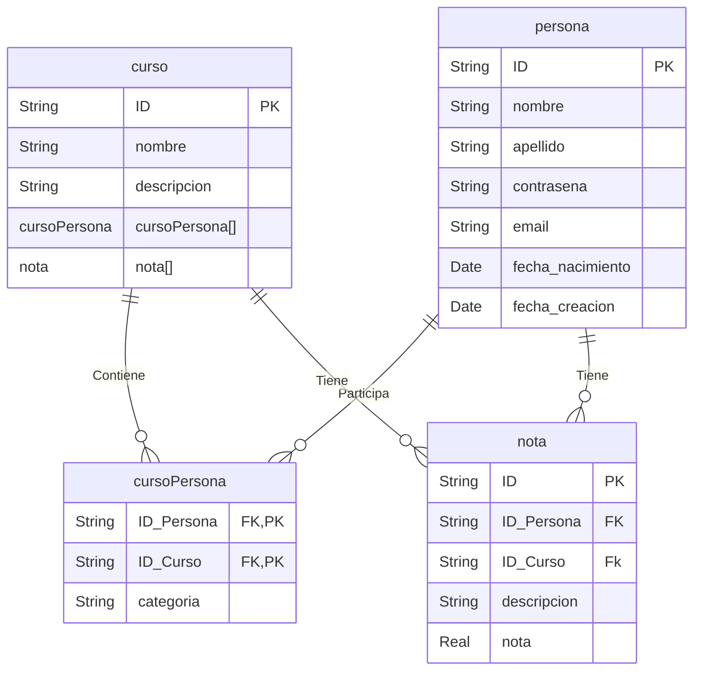

# Diagrama

Los ids no son mas autoincrementales son uuid.

```mermaid
erDiagram
    curso ||--o{ cursoPersona : Contiene
    persona ||--o{ cursoPersona: Participa
    persona ||--o{ nota: Tiene
    curso ||--o{ nota: Tiene

    persona{
        String ID PK
        String nombre
        String apellido
        String contrasena
        String email
        Date fecha_nacimiento
        Date fecha_creacion
    }
    curso{
        String ID PK
        String nombre
        String descripcion
        cursoPersona cursoPersona[]
        nota nota[]
    }
    cursoPersona{
        String ID_Persona FK,PK
        String ID_Curso FK,PK
        String categoria
    }
    nota{
        String ID PK
        String ID_Persona FK
        String ID_Curso Fk
        String descripcion
        Real nota
    }
```
